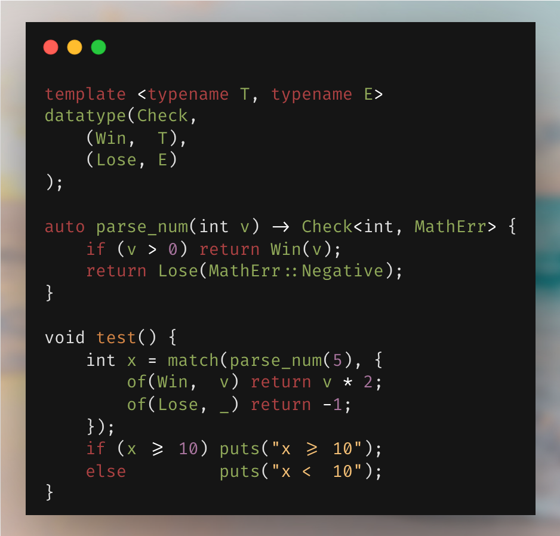

# cpp-datatype

### Algebraic data types and pattern matching for C++

Define sum types with `datatype`, then match on them with `match`. Supports templates, recursion, and a lot more. Inspired by [hirrolot/Datatype99](https://github.com/hirrolot/Datatype99). 

*Single header. No heap allocation. All tests pass with `clang` (not `clang++`; no C++ runtime features needed).*



## Goals

This library is designed to make it easy to define sum types (sometimes called `enum` or `variant`) that you can handle exhaustively. 

- Readable API
- Supports IDEs (symbol rename, type hints)
- Single header (`datatype.hpp`)
- No C++ runtime required
- No heap allocation
- Works as both statement and expression
- Full exhaustiveness via `-Wswitch` and `otherwise`
- Supports templates
- Built-in `Option<T>` and `Result<T, E>`

## Quick start

```cpp
#include "datatype.hpp"

datatype(Shape,
    (Circle, int),        // one int field: radius
    (Rect,   int, int),   // two fields: width, height
    (Point)               // unit variant — no payload
);

Shape c = Shape::Circle(12);

// Statement use 
void describe(Shape s) {
    match(s) {
        of(Circle, r) { printf("circle r=%d\n", r); }
        of(Rect, w, h){ printf("rect %dx%d\n",  w, h); }
        of(Point)     { printf("point\n"); }
    }
}

// Expression use
int area(Shape s) {
    return match(s, {
        of(Circle, r)  return r * r;
        of(Rect, w, h) return w * h;
        of(Point)      return 0;
    });
}
```

## Install

```bash
bash install.sh          # copies datatype.hpp to ~/.local/include/
```

Or just drop `datatype.hpp` next to your source file and `#include "datatype.hpp"`.

## API reference

### `datatype(Name, variants…)`

Declares a tagged union. Each variant is a parenthesised tuple:

```
(VariantName)                   // unit — no payload
(VariantName, T0)               // one field
(VariantName, T0, T1, …)        // up to 8 fields
```

Generates:
- `Name::VariantName(args…)` — static constructor
- `VariantName(args…)` — type-inferring proxy constructor
- `Name::Tag` enum with `VariantName_tag` members
- `Name::_variant_count` — number of variants (constexpr)
- Inner `struct _VariantName { T0 _0; T1 _1; … }` for layout

### Template / polymorphic data types

Place a `template` declaration directly above `datatype`:

```cpp
template <typename T>
datatype(Box,
    (Full, T),
    (Empty)
);

auto x = Box<int>::Full(42);
auto y = Box<float>::Empty();
```

Multi-parameter templates work too:

```cpp
template <typename L, typename R>
datatype(Either,
    (Left,  L),
    (Right, R)
);
```

### Proxy types and free constructors

You can construct variants either with fully-qualified constructors or free constructors. Free constructors are able to omit type information by generating a proxy type that implicitly converts only to a fully-typed version of its own datatype. The proxy type becomes fully-typed from the surrounding context. This is useful in certain situations, like function returns:

```
template<typename T>
datatype(Maybe,
    (Just, T),
    (Nothing),
);

auto m1 = Maybe<int>::Just(12); // fully qualified constructor
Maybe<int> m2 = Just(12); // proxy type from free constructor

auto div(int x, int y) -> Maybe<int> {
    if (y == 0) return Nothing();
    return Just(x / y);
};

// inferred types:
// Nothing() -> Maybe<int>::Nothing();
// Just(x / y) -> Maybe<int>::Just(x / y);
```

### Inheritance

While this library is designed for C-style C++, inheritance may sometimes be needed for certain functionality. Any arguments between the type name and the first variant tuple become inherited:

```cpp
struct Shape { int color = 0; };

datatype(Obj3D, Shape,
    (Sphere, int),
    (Square, int)
);

auto s = Obj3D::Sphere(5);
s.color = 0xFF0000;         // base member accessible
```

### `match(val) { }` vs `match(val, { })` — two forms

**Statement form** — `match(val) { of(…) { } … }`:
- `val` must be an lvalue
- `goto`/`break` to enclosing loops work freely (no lambda boundary)
- Arms don't `return`; use for side effects

```cpp
match(shape) {
    of(Circle, r)  { printf("r=%d\n", r); }
    of(Rect, w, h) { printf("%dx%d\n", w, h); }
    of(Point)      { puts("point"); }
    otherwise      { puts("?"); }     // optional catch-all
}
```

**Expression form** — `match(val, { of(…){ return …; } … })`:
- `val` may be an rvalue (lifetime extended inside the IIFE)
- All arms must `return` a consistent type; the whole expression evaluates to it

```cpp
int area = match(shape, {
    of(Circle, r)  { return r * r; }
    of(Rect, w, h) { return w * h; }
    of(Point)      { return 0;     }
});
```


**One arm per variant.** A switch can't have two `case V:` labels. For multi-condition dispatch on the same variant, use `if`-`else` inside a single arm:

```cpp
of(TNum, v) {
    if (v > 100) return "large";
    if (v > 0)   return "positive";
    return "other";
}
```

### `matches(val, Variant)` — predicate

```cpp
if (matches(shape, Circle)) { /* … */ }
```

Returns `bool` (technically `int 0/1`). No bindings.

### `if_let(val, Variant, bindings…)` — conditional binding

You can use `if_let` to conditionally enter a code path if a variant is true:

```cpp
if_let(shape, Circle, r) {
    printf("radius = %d\n", r);   // only runs when shape is Circle
}
```


### `Option<T>`

```cpp
Option<int> s = Some(42);
Option<int> n = None();

match(opt, {
    of(Some, v) { return v * 2; }
    of(None)    { return -1;    }
});

opt.map([](int v)      { return v + 1; });          // Option<int>
opt.and_then([](int v) { return Some(v * 2); });
opt.or_else([]         { return Some(0); });
opt.filter([](int v)   { return v > 0; });
opt.unwrap_or(-1);
opt.is_some();
opt.is_none();
```

### `Result<T, E>`

```cpp
auto parse_positive(int v) -> Result<int, MathError> {
    if (v > 0) return Ok(v);
    return Err(MathError::Negative);
}

match(res, {
    of(Ok,  v) { return v; }
    of(Err, e) { printf("error: %s\n", e); return -1; }
});

res.map([](int v)             { return v * 3; });
res.map_err([](const char* e) { return e[0]; });
res.and_then([](int v)        { return Ok(v * 2); });   
res.or_else([](const char*)   { return Ok(0); });       
res.unwrap_or(-1);
res.is_ok();
res.is_err();
```


## Examples

| File | Demonstrates |
|------|-------------|
| [e1.cpp](examples/e1.cpp) | Basic `datatype`, statement and expression match, `matches`, `if_let`, recursive tree |
| [e2.cpp](examples/e2.cpp) | Template data types (`Box<T>`, `Either<L,R>`, `List<T>`) |
| [e3.cpp](examples/e3.cpp) | `Option<T>` and `Result<T,E>` full API |
| [e4.cpp](examples/e4.cpp) | Exhaustiveness, multi-field destructuring, nested `match`, `where` guards |
| [e5.cpp](examples/e5.cpp) | AST evaluator, `Result` chaining, finite state machine |
| [e6.cpp](examples/e6.cpp) | Specialized `template <>` data types |
| [e7.cpp](examples/e7.cpp) | Inheritance support |
| [e8.cpp](examples/e8.cpp) | Proxy type polymorphism |


## Run all examples

```bash
bash test.sh
```

## Notes

- **Compiler:** `clang -std=c++17` (uses `__VA_OPT__`, C++17 if-with-initializer, C++20 `constexpr`)
- **Statement form** requires an lvalue; `goto`/`break` work to outer loops.
- **Expression form** accepts rvalues (IIFE `auto&&`); all arms must `return`.
- **`where` + `otherwise`:** must appear together; `where` uses a fixed label `_match_otherwise`. Nested statement-form matches with `where`+`otherwise` in the same function collide — use expression-form for the inner match.
- **Recursion:** For self-referential types, forward-declare the struct before `datatype`: `struct BTree; datatype(BTree, (Leaf,int), (Node,BTree*,int,BTree*));`
